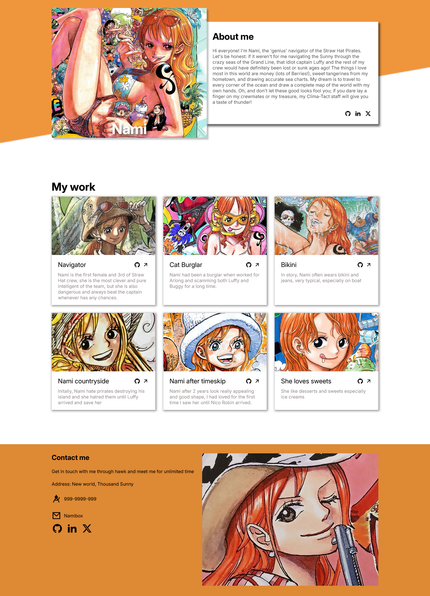
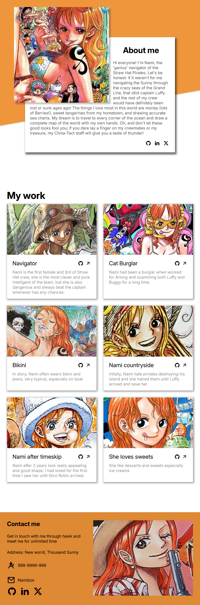

# Responsive Nami website

The website for responsive practicing with HTML, CSS 

## 🛠 Style
+ Font: Inter
+ Images source: [@Pinterest](https://www.pinterest.com/search/pins/?q=nami%20art&rs=typed)

## ♿ Accessibility
+ Semantic HTML(header, main, footer, section)
+ alt text for images

## The desktop

## The tablet

## The mobile

